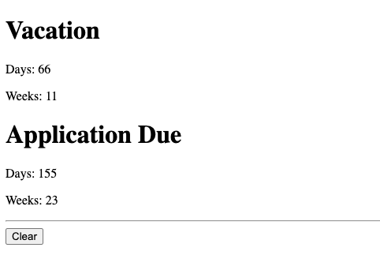

# M Countdown

A very simple webpage countdown for M, with some specifics about how she likes it to be counted;
now expanded to read data from a CSV or Google Spreadsheet, available on the internet.

1. [Usage](#usage)
1. [Format](#format)
1. [Example](#example)

# Usage
Simply enter the URL to a CSV file or Google Spreadsheet, and click "Submit".  
If using a Google Spreadsheet, make sure it is shared with "Anyone with the link".

[Go to MCountdown here](MCountdown.html) or [the GitHub Pages hosted one here](https://rkanter.github.io/MCountdown/MCountdown.html).

# Format
The CSV or Google Spreadsheet must have at least the following format, with any number of rows:

| Title     | Date            |
|-----------|-----------------|
| \<TITLE\> | \<TARGET_DATE\> |
| ...       | ...             |
The `<TITLE>` is the name you want to display as that countdown's title.  
The `<TARGET_DATE>` can be any date (and time) you want for the countdown.

You can optionally add a "Skip Weekends" column to skip Saturdays and Sundays (default is `FALSE`):

| Title     | Date            | Skip Weekends |
|-----------|-----------------|---------------|
| \<TITLE\> | \<TARGET_DATE\> | TRUE \| FALSE |
| ...       | ...             | ...           |

You can optionally add _any number_ of "Skip Date" columns to skip those specific dates:

| Title     | Date            | Skip Date | Skip Date... |
|-----------|-----------------|-----------|--------------|
| \<TITLE\> | \<TARGET_DATE\> | \<DATE\>  | \<DATE\>     |
| ...       | ...             | ...       | ...          |

# Example
Here's a simple example and what that would look like:

| Title           | Date            | Skip Weekends | Skip Date | Skip Date |
|-----------------|-----------------|---------------|-----------|-----------|
| Vacation        | 1/1/24          | TRUE          | 12/30/23  |           |
| Application Due | 3/2/24 4:00 PM  | FALSE         | 12/30/23  | 2/2/24    |

You can see a more complex live example by clicking "See Example" (also [here](https://docs.google.com/spreadsheets/d/1WiAqdmNUpdFK9TNP__R8MHtbhNRjhG67PAY-nQC7roo/edit?pli=1#gid=0)), and
load it by clicking "Load Example" (also [here](MCountdown.html?source=https%3A%2F%2Fdocs.google.com%2Fspreadsheets%2Fd%2F1WiAqdmNUpdFK9TNP__R8MHtbhNRjhG67PAY-nQC7roo%2Fedit%3Fpli%3D1%23gid%3D0)).
